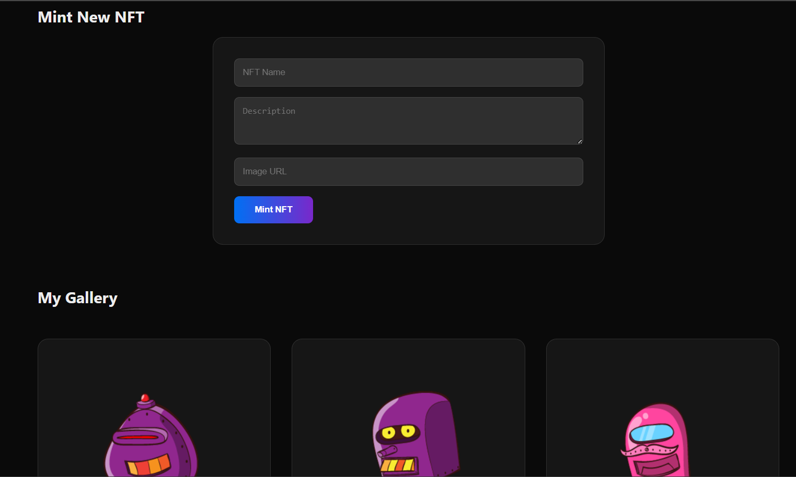

# Stellar NFT Gallery (Soroban)

A premium NFT Gallery built with **Next.js** and **Soroban**. Users can connect their **Freighter** wallet, view owned NFTs, and mint new ones on the Stellar Testnet.

## 🚀 Live Demo
[View Live Demo](https://stellar-nft-gallery.vercel.app/)

## 🎥 Demo Video


## 📸 Project Screenshot


## 🛠️ Tech Stack

- **Frontend**: Next.js 15+ (TypeScript)
- **Styling**: Vanilla CSS (Modern Dark Mode with Glassmorphism)
- **Blockchain**: Stellar Soroban
- **Wallet**: Freighter
- **API**: `@stellar/stellar-sdk`, `@stellar/freighter-api`
- **Testing**: Vitest + React Testing Library

## 🧪 Test Results
All 4 unit tests are passing, covering wallet connection, form rendering, gallery caching, and component integrity.

```text
 ✓ src/components/NFTCard.test.tsx (1 test)
 ✓ src/app/page.test.tsx (3 tests)

 Test Files  2 passed (2)
      Tests  4 passed (4)
```

## 📦 Getting Started

1. **Clone the Repository**:
   ```bash
   git clone https://github.com/yourusername/stellar-nft-gallery.git
   cd stellar-nft-gallery
   ```

2. **Install Dependencies**:
   ```bash
   npm install
   ```

3. **Run Development Server**:
   ```bash
   npm run dev
   ```

## 📜 Documentation

### Project Structure
- `src/app/page.tsx`: Main dashboard with wallet connection and minting logic.
- `src/lib/stellar.ts`: Stellar SDK and Freighter integration helpers.
- `src/components/`: Reusable UI components.
- `soroban/`: Soroban smart contract source code (Rust).

### Deployment
1. Build the project: `npm run build`
2. Deploy to Vercel: `vercel --prod`
3. Ensure the Soroban contract is deployed to Testnet and the Contract ID is updated in `page.tsx`.

---
*Built for the Stellar Level 3 Challenge.*
